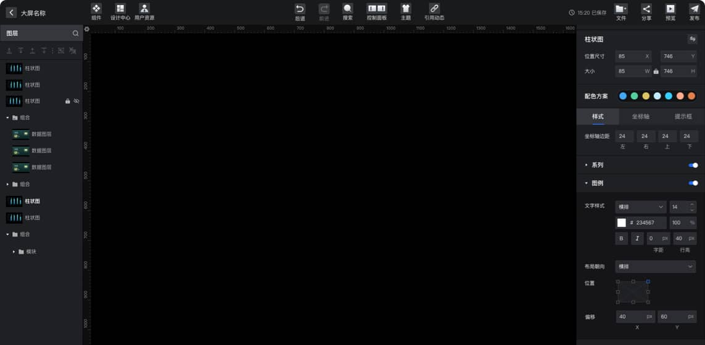
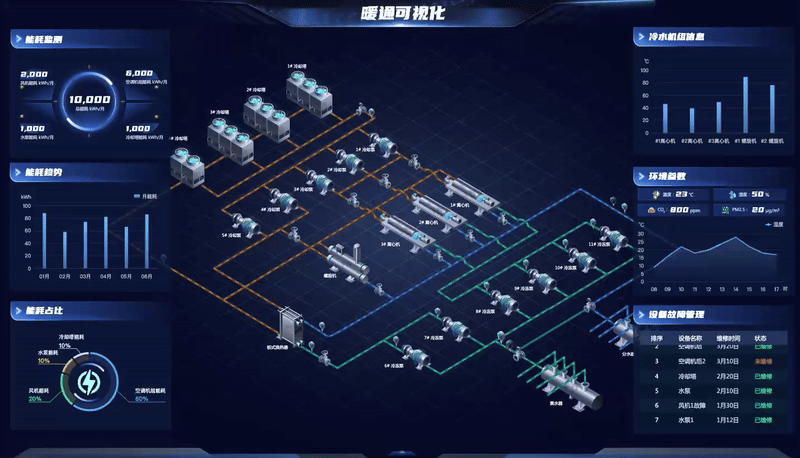
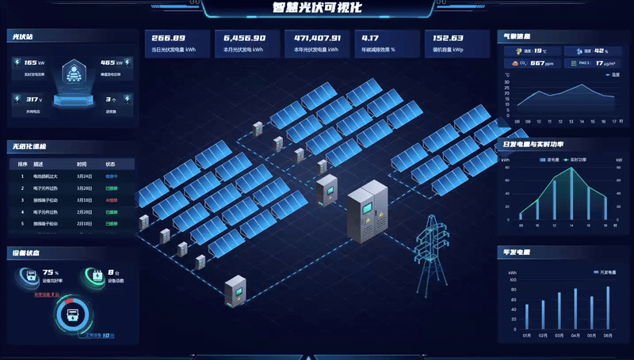

# 千行千屏-可视化平台-社区版

千行千屏社区版是基于企业版裁切而成，旨在为个人用户、学生和小型团队提供一个强大且易于使用的可视化编辑工具。

## 1. 了解 千行

可以访问我们的官方站点(https://www.qiantech.com.cn)了解千行。

### 1.1 企业版预览

企业版提供了更丰富的功能、素材、模板和定制选项，适合需要高级数据可视化解决方案的企业用户。

- 账号: test
- 密码: Qian@1234
- 地址: (https://www.qiantech.com.cn/qianping/)


## 2. 可视化平台说明

qian-datavis-community(千行千屏-社区版) 是一个 Vue3 搭建的低代码数据可视化开发平台，将图表或页面元素封装为基础组件，无需编写代码即可完成业务需求。 它的技术栈为：Vue3 + TypeScript5 + Vite5 + Element-Plus + ECharts5 + Axios

### 2.1 主要特点

用户友好的界面：社区版保留了企业版的直观界面，用户可以轻松上手，无需专业培训。
基础功能：支持基本的可视化编辑功能，包括拖放组件、实时预览。
社区支持：用户可以通过我们的论坛和社区获得支持，与其他用户分享经验和技巧。

### 2.2 与企业版的区别

- 功能限制：社区版包含了企业版的核心功能，但去除了高级功能和定制选项，例如图纸初始化脚本,高级绘制工具,高级组合等功能。

- 技术支持：社区版用户可以通过在线文档和社区论坛获得支持，而企业版用户则享有优先的技术支持服务。

## 3. 如何本地运行项目

### 3.1 环境要求

在本地运行本项目前，请先执行以下命令检查 Node.js 版本，本项目要求使用 Node.js v18 以及上

### 3.2 获取代码

```
git clone https://gitee.com/qiantech-design/qian-datavis-community
cd qian-datavis-community
npm install
```

### 3.3 运行项目

```
npm run dev
```

## 4. 社区与反馈

我们鼓励用户参与社区讨论，分享使用经验和反馈。您可以通过以下方式与我们联系：

- 论坛：访问我们的用户论坛，与其他用户交流。
- 反馈表单：在应用内提交反馈，帮助我们改进产品。

## 5. 联系我们

微信：QianHangService


QQ：3766696365


## 6. 企业版 部分功能展示








## ✨ 贡献者

感谢以下 qian-datavis-community 的贡献者

## 开源许可

Apache License 2.0
